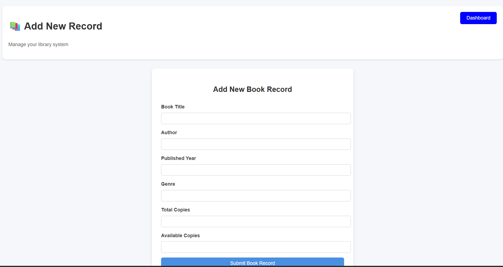
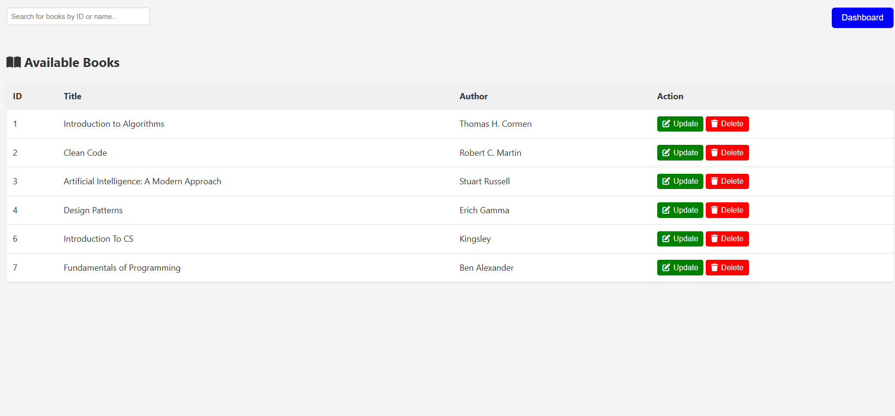
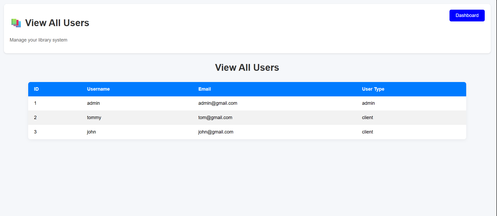
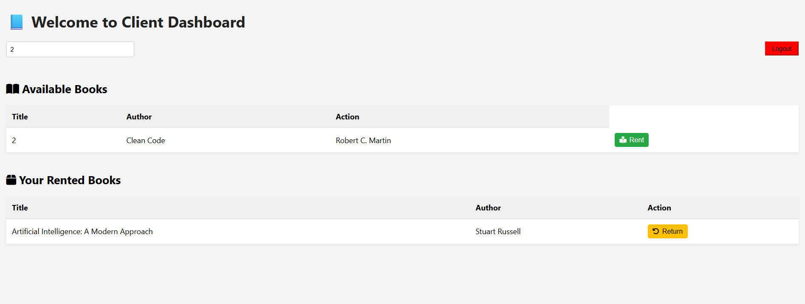
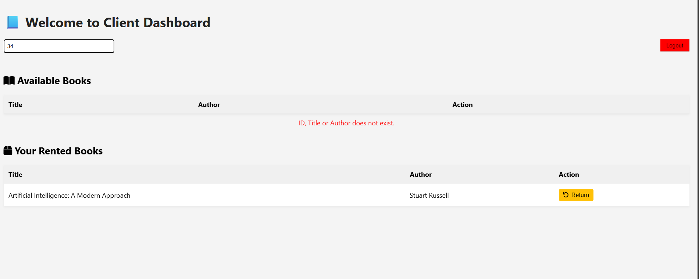

# Record Management System (UK RMS)

A web-based Library Record Management System for organizing, tracking, and managing books and users. Built with PHP, MySQL, and a custom router (created by me), this system supports both admin and client functionalities.
To get my custom router, run
   ```sh
   composer require ukingsley/customrouter
    ```
## Features

- **User Authentication:** Register, login, and logout for clients and admins.
- **Admin Dashboard:**

  - Add, update, and delete book records.
    
  - Add, update, and delete book records.
    
  - View all available books.
    
  - View all registered users.
    
- **Client Dashboard:**
    
  - Browse and search available books.
    
  - Displays a message when a book's ID, Author, Title isn't found.
    
  - View rented and unreturned books.
- **RESTful API:** Provides book data for dynamic front-end rendering.
    ```sh
    visit public/js/cli-dshbrd.js
    ```
- **Responsive UI:** Clean, modern interface with mobile support.

## Project Structure

```sh
    app/
    Core/
    Helper/
    Http/
    Models/
    Services/
    config/
    migrations/
    public/
    resources/
    Views/
    routes/
    src/
    vendor/
    index.php
    bootstrap.php
    composer.json
```

## Setup Instructions

1. **Clone the repository:**
   ```sh
   git clone https://github.com/yourusername/record_management_system.git
   cd record_management_system
   ```

2. **Install dependencies:**
   ```sh
   composer install
   ```

3. **Configure environment:**
   - Copy `.env.example` to `.env` and set your database credentials.

4. **Set up the database:**
   - Import the SQL files in the `migrations/` directory into your MySQL database.

5. **Run the application:**
   - Place the project in your web server's root (e.g., `c:/wamp64/www/Record_Management_System`).
   - Access via `http://localhost/record_management_system/`.

## Usage

- **Admin:** Log in with an admin account to manage books and users.
- **Client:** Register and log in to browse, rent, and return books.

## Technologies Used

- PHP (OOP)
- MySQL
- Composer (for autoloading and dependencies)
- Custom PHP Router
- HTML, CSS, JavaScript

## License

This project is licensed under the MIT License.

---

**Author:** ugwu kingsley
